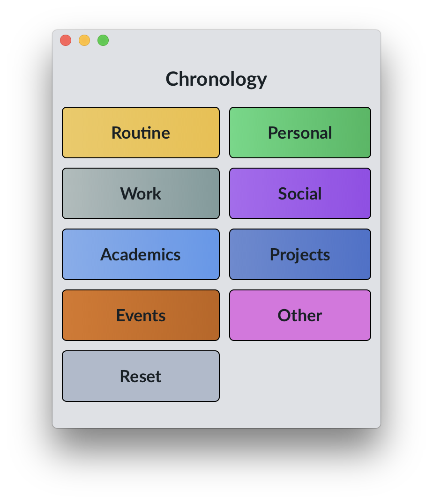

# Chronology

Chronology is an application for personal time tracking. It provides a simple interface for starting timers for events that are logged to an external service.

## Documentation

Documentation in progress.

